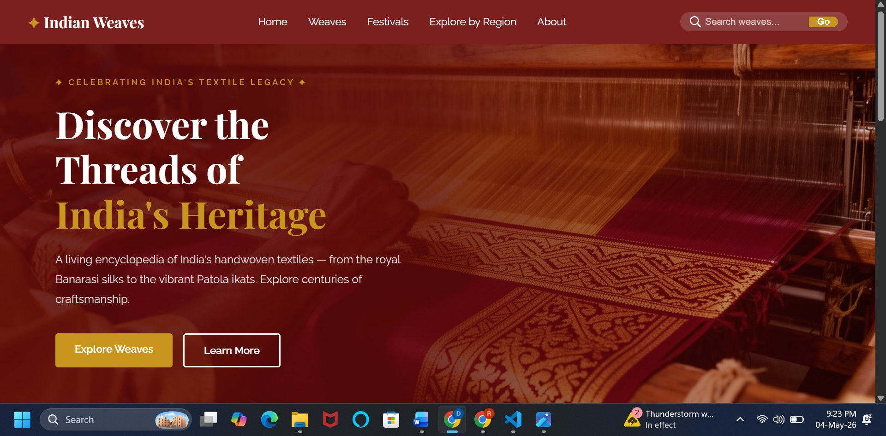
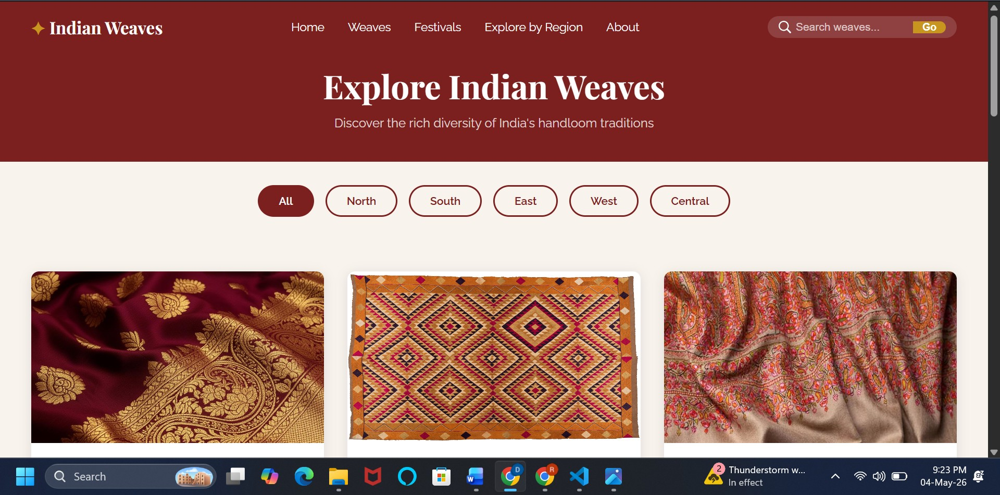
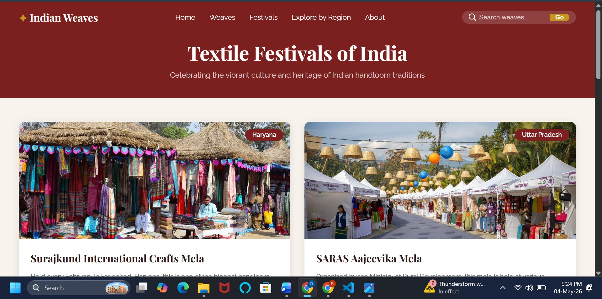
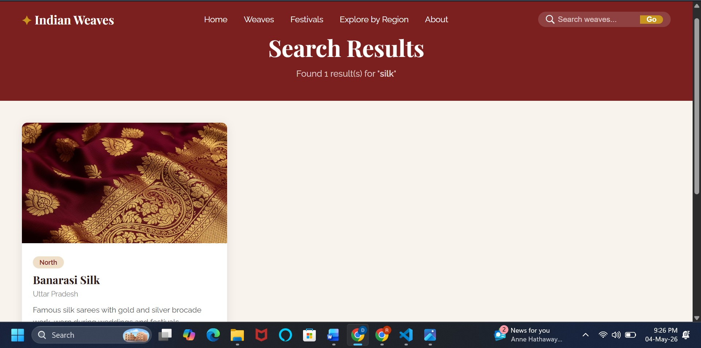
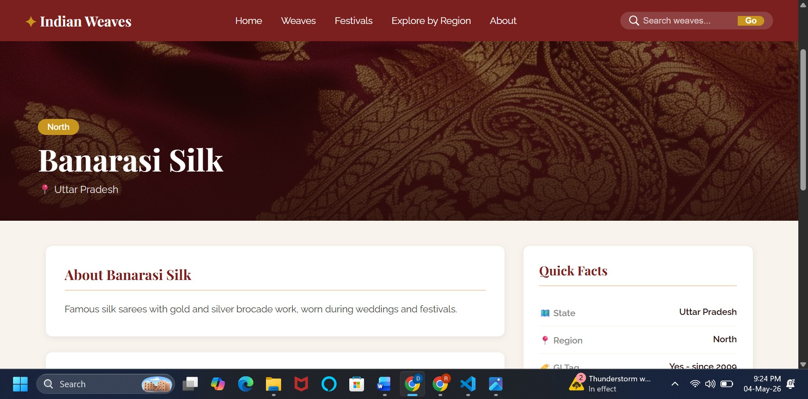
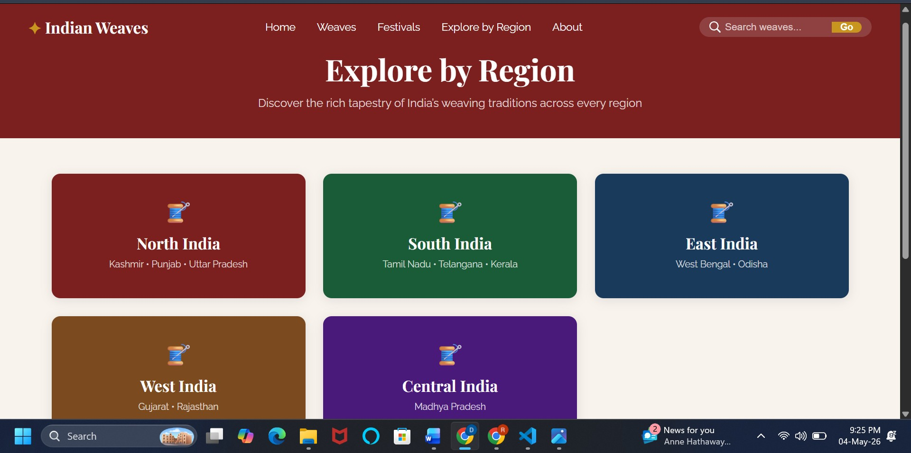

<div align="center">

# ✦ Indian Weaves
### A Digital Guide to Handloom & Textile Arts

<br/>


<br/>

> *"Every thread tells a story, every weave carries a legacy."*

<br/>

A full-stack web application that digitally preserves and promotes **India's rich handloom heritage** — bringing together weaving traditions, regional textile maps, GI-tagged crafts, and cultural festivals into one beautifully crafted platform.

<br/>

---

</div>

## ✦ About The Project

**Indian Weaves** is a centralized digital guide built to bridge the gap between India's centuries-old textile traditions and the modern digital world. From the royal **Banarasi silks** of Uttar Pradesh to the vibrant **Patola ikats** of Gujarat — every weave, every region, every festival is documented, searchable, and beautifully presented.

This project was developed as a final-year BTech project at **Vignan's Institute of Management and Technology for Women, Hyderabad** under the Department of Computer Science and Engineering (Data Science).

---

## ✦ Features

| Module | Description |
|--------|-------------|
| 🧵 **Weaves** | Browse 10+ Indian handloom traditions with images, descriptions, and GI tag details |
| 🗺️ **Explore by Region** | Discover textiles region-wise — North, South, East, West, and Central India |
| 🎪 **Festivals** | Explore 6 major Indian textile festivals with cultural significance |
| 🔍 **Search & Filter** | Dynamic SQL-powered search across weave name, state, and region |
| 🖼️ **Images & Descriptions** | High-quality visuals paired with weaving technique details and fun facts |
| ⚙️ **Admin Panel** | Add, update, and manage all content through the backend |

---

## ✦ Tech Stack

```
Frontend   →   HTML5 + CSS3 (Playfair Display & Raleway fonts)
Backend    →   Python 3.10 + Flask Framework
Database   →   MySQL 8.0
Server     →   Flask Development Server (localhost:5000)
IDE        →   Visual Studio Code
```

---

## ✦ Project Structure

```
indian_weaves/
│
├── app.py                        # Flask backend — all routes & DB logic
│
├── templates/                    # Jinja2 HTML templates
│   ├── home.html                 # Landing page with hero section
│   ├── weaves.html               # All weaves listing page
│   ├── weave_detail.html         # Individual weave detail page
│   ├── festivals.html            # Textile festivals page
│   ├── regions.html              # Explore by region page
│   ├── search.html               # Search results page
│   └── about.html                # About the project
│
├── static/
│   ├── css/
│   │   └── style.css             # All styling — navbar, hero, cards, footer
│   └── images/
│       ├── weaves/               # Weave images (banarasi, patola, etc.)
│       ├── festivals/            # Festival images
│       └── hero-loom.jpg         # Homepage hero background
│
└── requirements.txt              # Python dependencies
```

---

## ✦ Database Schema

```sql
-- Weaves Table
CREATE TABLE weaves (
    id          INT AUTO_INCREMENT PRIMARY KEY,
    name        VARCHAR(100),
    state       VARCHAR(100),
    region      VARCHAR(50),
    description TEXT,
    technique   TEXT,
    gi_tag      VARCHAR(255),
    fun_fact    TEXT,
    image       VARCHAR(255)
);

-- Festivals Table
CREATE TABLE festivals (
    id           INT AUTO_INCREMENT PRIMARY KEY,
    name         VARCHAR(100),
    location     VARCHAR(100),
    significance TEXT,
    image        VARCHAR(255)
);
```

---

## ✦ Getting Started

### Prerequisites
- Python 3.10+
- MySQL 8.0+
- pip

### Installation

```bash
# 1. Clone the repository
git clone https://github.com/deepikakottapalli/indian-weaves.git
cd indian-weaves

# 2. Create and activate virtual environment
python -m venv venv
venv\Scripts\activate        # Windows
source venv/bin/activate     # Mac/Linux

# 3. Install dependencies
pip install flask mysql-connector-python

# 4. Set up the MySQL database
# Open MySQL and run the schema SQL file
# Update DB credentials in app.py

# 5. Run the application
python app.py
```

### Access the App
```
http://localhost:5000
```

---

## ✦ Key Routes

```python
GET  /              → Home page
GET  /weaves        → All weaves listing
GET  /weave/<id>    → Single weave detail
GET  /festivals     → All festivals
GET  /regions       → Explore by region
GET  /search?q=     → Search results
GET  /about         → About page
```

---

## ✦ Screenshots

| Home Page | Weaves Page |
|-----------|-------------|
|  |  |

| Festivals Page | Search Results |
|----------------|----------------|
|  |  |

| Weave Detail Page | Explore by Region |
|-------------------|-------------------|
|  |  |

---

## ✦ Weaves Covered

```
🟡 Banarasi Silk      — Uttar Pradesh     (North)
🟠 Phulkari           — Punjab            (North)
🔴 Pashmina           — Kashmir           (North)
🟢 Kanjeevaram        — Tamil Nadu        (South)
🔵 Kasavu             — Kerala            (South)
🟣 Pochampally Ikat   — Telangana         (South)
🟤 Kantha             — West Bengal       (East)
⚫ Sambalpuri         — Odisha            (East)
🔶 Patola             — Gujarat           (West)
🟦 Bandhani           — Rajasthan/Gujarat (West)
🟨 Chanderi           — Madhya Pradesh    (Central)
```

---

## ✦ Future Enhancements

- [ ] 🌐 Multilingual support (Hindi, Telugu, Tamil)
- [ ] 🧑‍🎨 Artisan directory with contact and purchase links
- [ ] 🤖 AI-based weave recommendation engine
- [ ] ☁️ Cloud deployment (AWS / Heroku)
- [ ] 📱 Mobile application (Android)
- [ ] 🛒 E-commerce integration for direct textile purchases

---


## ✦ Acknowledgements

- [Flask Documentation](https://flask.palletsprojects.com)
- [MySQL Documentation](https://dev.mysql.com/doc)
- [Office of the Development Commissioner for Handlooms](https://handlooms.nic.in)
- [Geographical Indications Registry of India](https://ipindia.gov.in)
- [National Handloom Development Corporation](https://nhdc.org.in)

---

<div align="center">

**✦ Made with love for India's artisans and their craft ✦**

*© 2026 Indian Weaves — Celebrating India's Textile Heritage*

</div>
